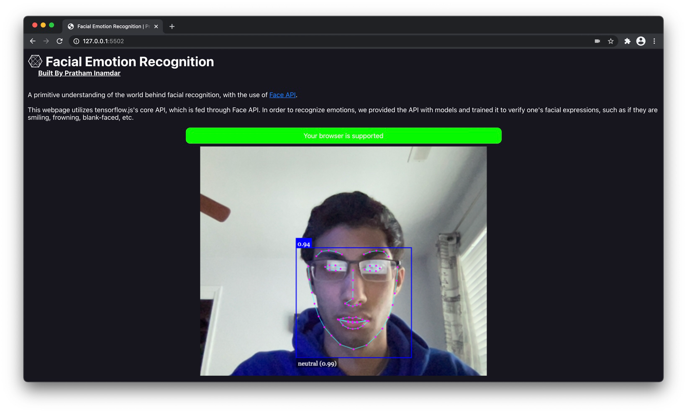
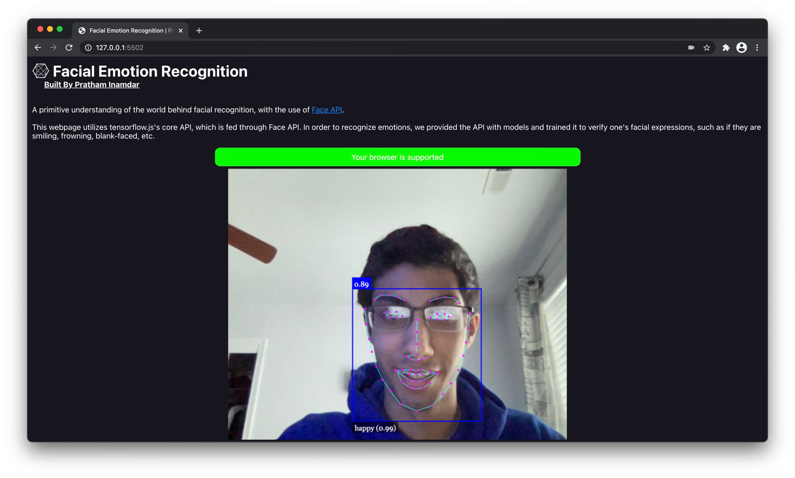
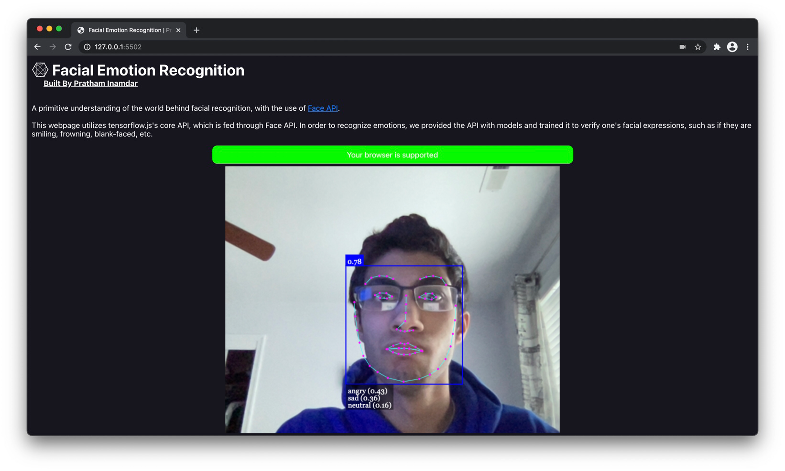

# Facial Emotions with Face API
This website, built with face-api-js, can recognize a person's user data and their emotions. Built on top of tensorflow.js core, which implements several CNNs (Convolutional Neural Networks) to solve face detection, face recognition and face landmark detection.

## How it works
As this is a website, it is built with HTML, and CSS, for the major structuring and styling of the webpage. For the face emotional recognition aspect of the web application, the program features a video portion in the ```<body>``` of the page. This video then feeds a camera view of the user to the webpage, for both the API and the user to see. With the camera view, the API then compares what it analyzes with the ```/models``` the root directory provides, to then decide what emotion the user currently is experiencing. 

## Project in action
Here is a view of the website with different test subjects (as emotions, not different humans).









## Dependencies utilized
- Face API
- HTML & CSS
- Tensorflow (API)
